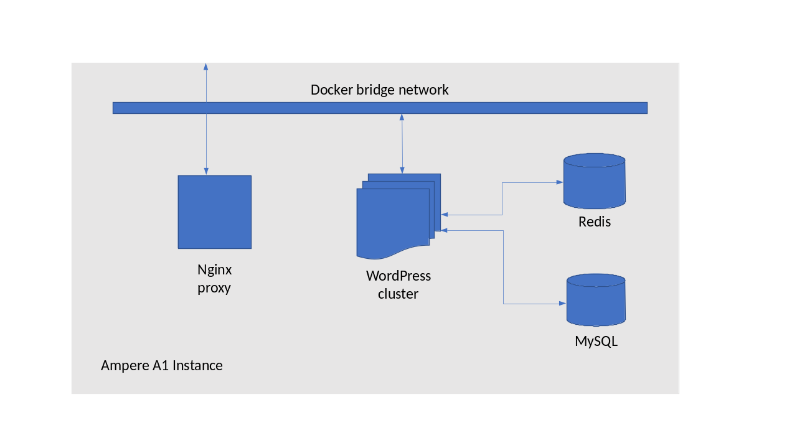
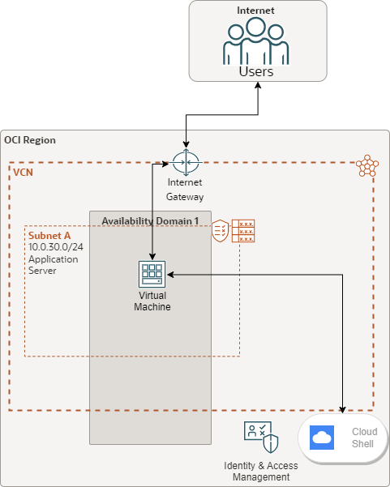

# Welcome to Pi Day 2023!

This hour, we will take a journey through what is involved in putting together
a realistic cloud-native application using Docker containers in a single
Ampere A1 VM instance on Oracle Cloud. By the end of our time together, you
will have:

* Created a Wordpress instance and a separate MySQL instance with some
  reference content
* Added an nginx proxy to enable us to hide the application's internal
  architecture, and make changes to scale our application
* Enable load balancing across multiple WordPress instances
* Installed a caching system which will accelerate the delivery of static
  content
* Added a [Redis object cache](https://redis.io/)  which will reduce the
  amount of compute power used by our web servers
* At each step, we will test the performance of our instance to verify that
  we are improving its performance and scalability

For the purposes of today's presentation, we will do all of these in a single
four-OCPU Ampere Altra A1 instance on the OCI Always Free tier. There are
lots of things we could do to continue to make this application more "cloud
native", including registering for SSL certificates and enabling secure
access over HTTPS, using object storage for uploads rather than saving them
to the filesystem, backing up our database for effective disaster recovery,
adding monitoring to ensure that we stay on top of the load of the
application, and moving our application to a clustered solution based on
Kubernetes.

However, all of this is out of scope for today. By the end of today's session,
you will have a total of six container instances running. We will map port 80
of our VM to port 80 of the nginx container, and use a network bridge to
connect all of our application containers. Our final WordPress architecture
will look like this:



## Infrastructure Deployment

To begin, you will need an Ampere A1-powered Compute instance running on Oracle Cloud Infrastructure (OCI). The following provides three different options for deploying the necessary cloud infrastructure. Please select an option that you're comfortable with, and remember, you can always come back later to explore the others.

1. Deploy using the [Web UI](howto-webui.md)
2. Deploy using Terraform and [OCI Resource Manager](howto-terraform-rms.md)
3. Deploy using Cloud Shell and the [Command Line Interface (CLI)](howto-commandline.md)

**_important note:_** Throughout this session, we will assume that you are running Oracle Linux 8,
and the tutorial has made this assumption for all commands, file locations,
and usernames.

<p align="center"></p>
<p align="center"><i>fig. 1: simple architecture overview</i></p>

## Application setup and deployment

Once you have your instance running Oracle Linux, there are a few things we will
need to install to ensure that we can run docker-compose to launch our application.

1. As root, install Docker, and updating operating system packages:
```
sudo -s
dnf install -y yum-utils
yum-config-manager --add-repo https://download.docker.com/linux/centos/docker-ce.repo
dnf update -y && dnf install -y docker-ce docker-ce-cli containerd.io
```
2. Enable the Docker service, and ensure that the opc user can run it:
```
systemctl start docker && systemctl enable docker
usermod -aG docker opc
sudo -s -u opc
```
3. Now check that the opc user is in the docker group, and has permission to run Docker:
```
groups
docker run hello-world
```
4. Download and install `docker-compose`:

   Check [the docker-compose releases page](https://github.com/docker/compose/releases)
   for more recent releases. Make sure you choose the `linux-aarch64` binary

```
sudo curl -L https://github.com/docker/compose/releases/download/v2.16.0/docker-compose-linux-aarch64 -o /usr/local/bin/docker-compose && sudo chmod +x /usr/local/bin/docker-compose
```
5. Finally, we will install `git` and download the repository for today's session:
```
sudo dnf install -y git
git clone https://github.com/AmpereComputing/pi-day-tutorial
```

We now have everything we need to get started! We will build up in stages.

1. In [part 1](wordpress1), we will start a new WordPress instance from scratch,
   and go through the installation process. The configuration files to enable you
   to do this are in the folder `wordpress1`.
2. In [part 2](wordpress2), we will pre-load some content (including this post and
   documentation for this session!) to our WordPress instance, and add an nginx proxy
   to pass through connections. All the content for this is in `wordpress2`.
3. In [part 3](wordpress3), we will start another two WordPress instances
   and configure nginx to load balance across them. You can find the 
   instructions and content to do this in `wordpress3`.
4. Finally, in [part 4](wordpress4), we will add a caching plug-in to WordPress,
   start a Redis instance, and configure WordPress to use Redis as an object cache.
   Surprisingly, the content for this step is in `wordpress4`.

[Let's get started!](wordpress1/)


