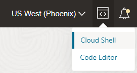

# Welcome to Pi Day 2023!

## Infrastructure Deployment with the OCI CLI

The entirety of this workshop can be run on a single OCI Compute Instance powered by **Ampere®**. The Compute instance will run inside of a Virtual Cloud Network (VCN) in a public subnet. You can create a VCN using the WebUI - check out the [demo video](https://www.youtube.com/watch?v=OxDxE-YyuUU) for details. In this exercise, however, we are going to leverage Cloud Shell and the OCI Command Line Interface (CLI).

1. Log into your OCI Cloud Tenancy and launch the Cloud Shell.

    

2. Cloud Shell provides integrated privileges according to your logged on user so there are no additional configuration steps required. To test it out, you can run the following command:

        oci iam availability-domains list

3. Now capture some information about your tenancy and store as environment variables for future commands:

       adName=($(oci iam availability-domain list --query 'data[?contains ("name",`AD-1`)]|[0].name' --raw-output))

        adId=($(oci iam availability-domain list --query 'data[?contains ("name",`AD-1`)]|[0].id' --raw-output))

        compOcid=($(oci iam compartment list --query 'data[0]."compartment-id"' --raw-output))

    *note:* The last command will retrieve your tenancy OCID. If you'd prefer to use a different compartment, you can use (replace 'Training' with your own compartment name):

        compOcid=($(oci iam compartment list --query 'data[?name==`Training`]|[0].id' | --raw-output))

4. Create an SSH key to for logging into your OCI Compute Instance.

        ssh-keygen -b 2048 -t rsa -f oci_labs

5. Create your Virtual Cloud Network.

        vcnOcid=($(oci network vcn create --cidr-block 10.0.0.0/16 -c $compOcid --display-name PiDay-VCN --dns-label pidayworkshop --query 'data.id' --raw-output))

6. Create a security list and allow ingress traffic on ports 80, 443, and 22.

       seclistOcid=('["'$(oci network security-list create --display-name PiDay-PubSub1 --compartment-id $compOcid --vcn-id $vcnOcid --egress-security-rules  '[{"destination": "0.0.0.0/0", "destination-type": "CIDR_BLOCK", "protocol": "all", "isStateless": false}]' --ingress-security-rules '[{"source": "0.0.0.0/0", "source-type": "CIDR_BLOCK", "protocol": 6, "isStateless": false, "tcp-options": {"destination-port-range": {"max": 80, "min": 80}}},{"destination": "0.0.0.0/0", "destination-type": "CIDR_BLOCK", "protocol": "all", "isStateless": false}]' --ingress-security-rules '[{"source": "0.0.0.0/0", "source-type": "CIDR_BLOCK", "protocol": 6, "isStateless": false, "tcp-options": {"destination-port-range": {"max": 443, "min": 443}}},{"source": "0.0.0.0/0", "source-type": "CIDR_BLOCK", "protocol": 6, "isStateless": false, "tcp-options": {"destination-port-range": {"max": 22, "min": 22}}}]' --query 'data.id'  --raw-output)'"]') 

7. Create an Internet Gateway and add a new public route to the default route table.

        igwId=($(oci network internet-gateway create -c $compOcid --is-enabled true --vcn-id $vcnOcid --display-name PiDayDemo --query 'data.id' --raw-output))

        rtId=($(oci network route-table list -c $compOcid --vcn-id $vcnOcid --query 'data[0].id' --raw-output))

        oci network route-table update --rt-id $rtId --route-rules '[{"cidrBlock":"0.0.0.0/0","networkEntityId":"'$igwId'"}]'

    *note:* you will be prompted to type 'Y' to continue

8. Create your public subnet.

        pubsubId=($(oci network subnet create --cidr-block 10.0.10.0/24 -c $compOcid --vcn-id $vcnOcid --security-list-ids $seclistOcid --query 'data.id' --raw-output))

9. Choose the image you would like to use. For this workshop, it is *recommended* you use Oracle Linux 8. Several options are shown for illustration purposes, though additional configuration steps may be necessary if you choose a different compute image.

        #Oracle Linux 8.6
        imageOcid=($(oci compute image list -c $compOcid --query 'data[?contains ("display-name",`Oracle-Linux-8.6-aarch`)]|[0].id' --all --raw-output))

        #Oracle Linux Developer Image
        imageOcid=($(oci compute image list -c $compOcid --query 'data[?contains ("display-name",`Developer-8.5`)]|[0].id' --all --raw-output))
        
        #Ubuntu 22.04
        imageOcid=($(oci compute image list -c $compOcid --query 'data[?contains ("display-name",`Canonical-Ubuntu-22.04-aarch64`)]|[0].id' --all --raw-output))

10. Time to query compatible impage shapes based on the selected image. It should return the VM Flex Ampere shape.

        instShape=($(oci compute image-shape-compatibility-entry list --image-id $imageOcid --query 'data[?contains ("shape",`VM`)]|[0].shape' --raw-output)) && echo $instShape

11. Now launch the compute instance and return the public IP address.

        instOcid=($(oci compute instance launch --availability-domain $adName -c $compOcid --shape $instShape --subnet-id $pubsubId --image-id $imageOcid --shape-config '{"memoryInGBs":12,"ocpus":4}' --ssh-authorized-keys-file ~/.ssh/id_rsa.pub  --freeform-tags '{"resourceDetails":"PI Day Demo Instance","resourceNotes":"Time to deploy some containers"}' --display-name Pi-Day-Demo-Instance --wait-for-state RUNNING --query 'data.id' --raw-output)) && vnicOcid=($(oci compute vnic-attachment list --instance-id $instOcid -c $compOcid --query 'data[0]."vnic-id"' --raw-output)) && oci network vnic get --vnic-id $vnicOcid --query 'data."public-ip"' --raw-output

12. Once the public IP address is returned you can go ahead and ssh into the instance.

        ssh -i ~/.ssh/id_rsa opc@<public-ip>

    *note:* You might need to wait a minute or two after launching the instance before you can initiate the SSH connection.

**You're all set!** Now head back to the [main instructions](README.md#application-setup-and-deployment) to complete the workshop.