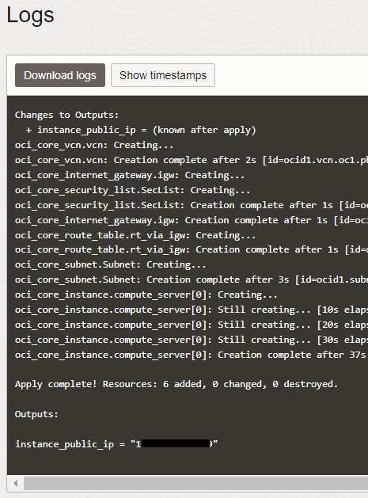

# Welcome to Pi Day 2023!

## Infrastructure Deployment with Terraform

The entirety of this workshop can be run on a single OCI Compute Instance powered by **Ampere®**. The Compute instance will run inside of a Virtual Cloud Network (VCN) in a public subnet. If you're reading this, its because you chose to deploy these resources using Terraform and the Resource Manager Service (RMS)...so lets do this!

1. Go ahead and download the pre-built Terraform configuration zip file [here](https://github.com/AmpereComputing/pi-day-tutorial/blob/main/terraform/oci-pi-day-main.zip)

2. Log into your OCI Cloud Tenancy and navigate to Resource Manager. You'll find it in the menu under Developer Services.

3. Click **Stacks** and then [Create stack]

4. Under Stack configuration, select the radio button for .Zip file and upload the file from step 1. Once the contents of the Zip file have been evaluated, you should see Stack information populated:

    

5. Click [Next] - the form will pre-populate with all of the pre-defined values. You will, however, need to supply an SSH key.

    _**note**_ if you do not already have an SSH key, you can create one in the Cloud Shell.

        ssh-keygen -t rsa -N "" -b 2048

    Collect the contents of the .pub file and paste in the **SSH Public Key** field.

6. Click [Next]

7. Select the check box to "Run apply" and click [Create]

8. While the job is running, you can watch the logs in real-time. When everything is complete, you will see the public IP address for your compute instance at the bottom of the log file. Grab it...quick!!

    

9. Log into the instance via SSH using your favorite SSH tool. 

        ssh -i ~/.ssh/id_rsa opc@<public-ip>

    *note:* You might need to wait a minute or two after launching the instance before you can initiate the SSH connection.

    *note:* If you are using Putty for SSH connectivity, you will need to convert the private key to a .PPK - [detailed steps here](https://docs.oracle.com/en/cloud/paas/goldengate-cloud/tutorial-change-private-key-format/)

**You're all set!** Now head back to the [main instructions](README.md#application-setup-and-deployment) to complete the workshop.

