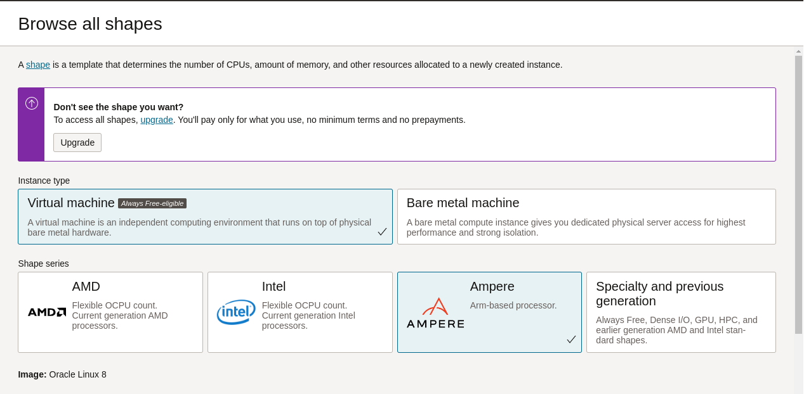
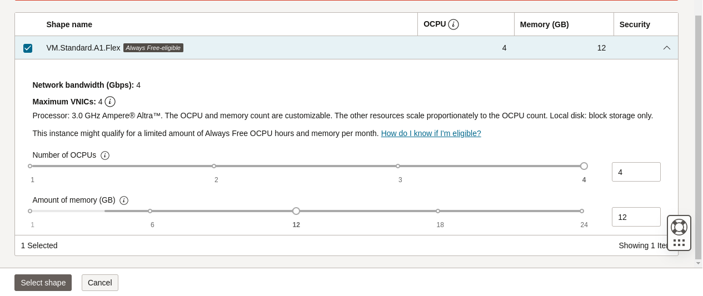

# Welcome to Pi Day 2023!

## Infrastructure Deployment with the Web UI (OCI Console)

The entirety of this workshop can be run on a single OCI Compute Instance powered by **Ampere®**. The Compute instance will run inside of a Virtual Cloud Network (VCN) in a public subnet. You still start by creating your VCN with requisite security posture, then proceed to launch the compute instance.

### Virtual Cloud Network

1. Log into your OCI Cloud Tenancy and navigate to .

    

2. Click [Start VCN Wizard] - because we all get to be wizards every once in awhile!

3. Select the option to _Create VCN with Internet Connectivity_ and click [Start VCN Wizard] button.

    

4. Provide a name for your VCN - might we suggest "PiDay2023?" You can leave all other settings (including VCN CIDR) as default. The wizard will create both public and private subnets, an Internet Gateway(IG), a NAT Gateway, and a Service Gateway (SG). _though we will not utilize the NAT gateway and the Service Gateway, there is zero cost for these items_

5. Click [Next], then click [Create]. Wait a few seconds for the process to complete, then click [View VCN].

6. Just one more change to make - click on [Subnets] and then click the Public Subnet. Note that it is utilizing the Security List aptly named: "Default Security List for <VCN>"

7. Click the security list name and you should find 3 existing ingress rules: one for TCP port 22 (SSH) and 2 others for ICMP. Click [Add Ingress Rules]

8. Input "0.0.0.0/0" for Source CIDR and "80" for Destination Port Range. You may also include a comment indicating this is for ingress HTTP traffic.

    

9. Click [Add Ingress Rule] and you're all set.  Time to launch a compute instance!

### Compute Instance

We will create the instance in the “root” compartment. In the “Image
and shape” section, we are going to edit the defaults, and under “Shape”, we
will change the shape to choose the Ampere type, with 4 OCPUs and 12 GB of RAM –
this will max out your “Always Free” quota.

1. From the menu, select Compute -> Instances, and click [Create Instance]

2. Feel free to change the instance name to something more meaningful _(i.e. PiDay2023-Server)_

3. Under **Image and shape** make sure to select the Ampere family:

    Choosing the Ampere family:
    

4. Make sure to size the instance properly:

    

5. In the **Networking** Section, make sure the VCN just createdis selected, along with the corresponding public subnet.

6. In the **Add SSH Keys* section, you can generate a key pair (make sure to download the private and public key before you continue) or Upload / Paste and existing key pair.

7. Click [Create] and give it a minute.

8. Locate the public IP address of the instance once it has finished booting:

    

9. Log into the instance via SSH using your favorite SSH tool. 

        ssh -i ~/.ssh/id_rsa opc@<public-ip>

    *note:* You might need to wait a minute or two after launching the instance before you can initiate the SSH connection.

    *note:* If you are using Putty for SSH connectivity, you will need to convert the private key to a .PPK - [detailed steps here](https://docs.oracle.com/en/cloud/paas/goldengate-cloud/tutorial-change-private-key-format/)

**You're all set!** Now head back to the [main instructions](README.md#application-setup-and-deployment) to complete the workshop.