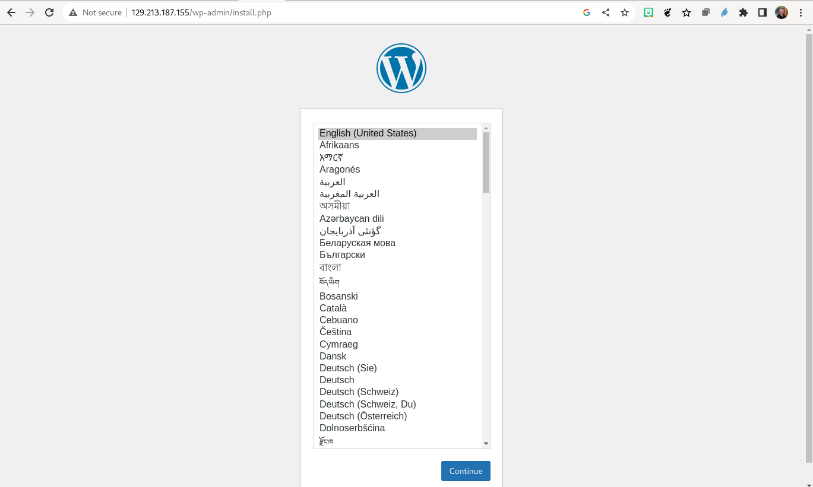
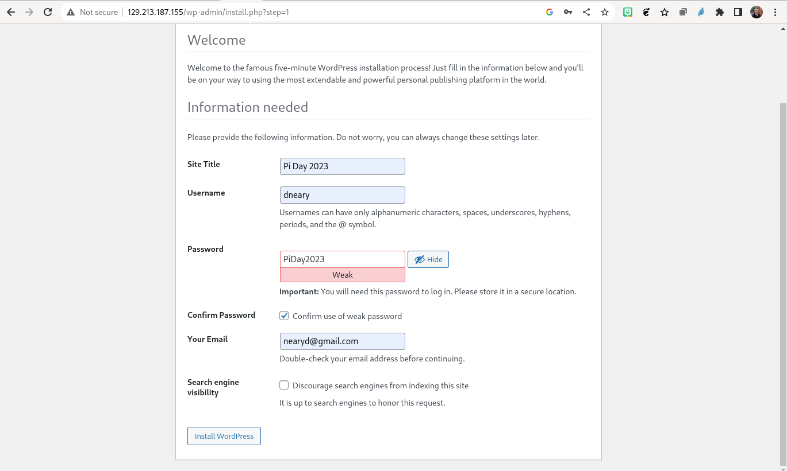
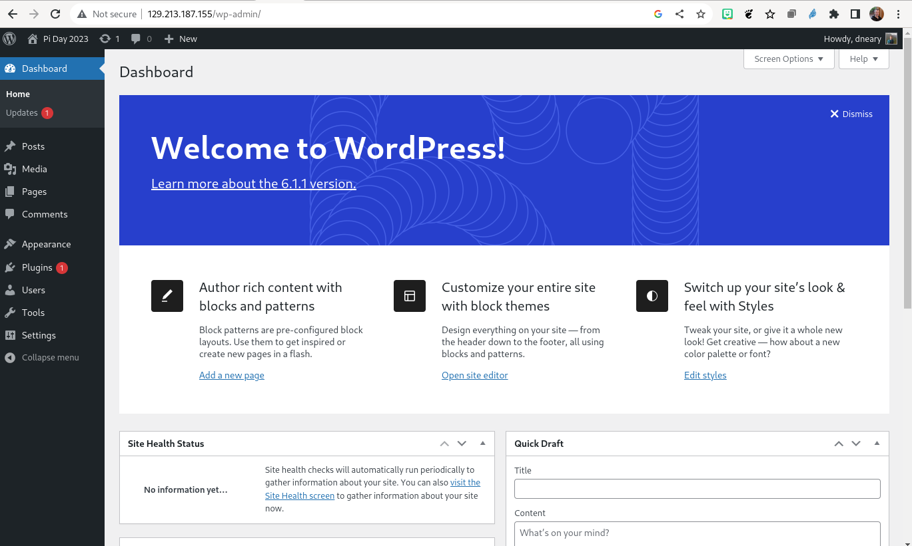

# Part 1: A basic WordPress installation

In our last post, we installed a variety of prerequisites to let us run a multi-container
application using `docker-compose`. In this post, we will get started with a WordPress
instance. The working directory for this step will be `docker-lamp/wordpress1`. Looking
in the directory, we see two files: `docker-compose.yml` and `README.md` (which contains this
text). Our docker-compose.yml is quite simple at this stage:

```
version: "3"

services:
  wordpress:
    restart: always
    image: wordpress:6.1-apache
    environment:
      WORDPRESS_DB_HOST: 'db'
      WORDPRESS_DB_USER: 'wordpress'
      WORDPRESS_DB_PASSWORD: 'password1234'
      WORDPRESS_DB_NAME: 'wordpress'
    ports:
      - 80:80
    networks:
      - external_network
    volumes:
      - ./wordpress:/var/www/html

  db:
    image: mysql/mysql-server:8.0
    restart: always
    environment:
      MYSQL_DATABASE: 'wordpress'
      MYSQL_USER: 'wordpress'
      MYSQL_PASSWORD: 'password1234'
      MYSQL_ROOT_PASSWORD: 'password'
    healthcheck:
      test: "mysql $$MYSQL_DATABASE -u$$MYSQL_USER -p$$MYSQL_PASSWORD -e 'SELECT 1;'"
      interval: 20s
      timeout: 10s
      retries: 5
    networks:
      - external_network
    volumes:
      - ./mysql/wordpress:/var/lib/mysql
      - ./mysql/logs:/var/log/mysql
      - ./mysql/initdb:/docker-entrypoint-initdb.d


networks:
  external_network:
```

We are going to download and start two containers, `mysql/mysql-server` and `wordpress`.
Each of these containers have multiple options – for WordPress we will download version
6.1 configured to use Apache 2, and for MySQL, we download the `mysql-server` version 8.0
container. Both of these containers support configuration through environment variables
which is documented on their respective pages on DockerHub
([mysql-server](https://hub.docker.com/r/mysql/mysql-server), 
[wordpress](https://hub.docker.com/_/wordpress)) –
the environment variables we pass into the MySQL database will auto-create the
`wordpress` database, and create a `wordpress` user with the password `password1234` –
and while, in principle, the database is not accessible to the outside world, you should
probably choose a different password ;-)

One interesting feature of this first configuration file is the `healthcheck` section
for MySQL. As we advance in the project, it can take a few seconds before MySQL is ready
to accept connections. We add a healthcheck which runs a trivial query. It waits 20s
between checks, and in a future step, we will delay starting the `wordpress` containers
until the database is finished its initialization.

Inside our project, the containers will be able to talk to each other using just their
service name. That’s why, in our WordPress container, we can set the `WORDPRESS_DB_HOST`
environment variable to just `db`. As we will see when we start our application, the
containers will be started with the name `$PROJECT-$SERVICE-$VERSION` – the project
name is taken from the directory, and the service names are `wordpress` for our
WordPress container, and `db` for our MySQL database. If we want to refer to a
container by name from the host, we will have to use the full `name wordpress1-db-1`
or `wordpress1-wordpress-1`.

We also add all containers to a Docker bridge network we create just for our application,
called `external-network` and we connect port 80 of our WordPress container to port 80
of our host, so that connections to `http://$IP_ADDRESS:80` are handled by the container.

To enable our data to persist after the containers are deleted, we also use some local
volumes to map some local directories in our project to locations “mounted” in our
containers. Importantly, we will create our database in the directory `mysql/wordpress`
and will put the WordPress installation files (which will include things like uploaded
files and plug-ins) in `wordpress`.

To ensure that everything works correctly, we will create the directories before we get started:

```
mkdir -p mysql/initdb mysql/logs mysql/wordpress
docker-compose up -d
```

If everything has gone well, you should see Docker pulling two containers consisting of
about 30 “layers”, creating our network, and starting the containers. We can verify that the
containers started correctly with `docker-compose ps` and if you now go to `http://$IP_ADDRESS`
(obtained from your OCI console) you should see the WordPress installation screen.

```
[opc@cloud-native-wordpress wordpress1]$ docker-compose ps
NAME                     IMAGE                    COMMAND                  SERVICE             CREATED             STATUS                 PORTS
wordpress1-db-1          mysql/mysql-server:8.0   "/entrypoint.sh mysq…"   db                  3 hours ago         Up 3 hours (healthy)   3306/tcp, 33060-33061/tcp
wordpress1-wordpress-1   wordpress:6.1-apache     "docker-entrypoint.s…"   wordpress           3 hours ago         Up 3 hours             0.0.0.0:80->80/tcp, :::80->80/tcp
```



Clicking through this, we can now name our blog, create a user ID and password, and log in to
our blog to see a “Hello World” post, create our first page, and write our first blog
entry – all running in containers, and started in a few minutes!





In our next step, we will augment this application by moving to an nginx proxy, and
pre-loading some content into our blog. You can now bring down your WordPress instance
with `docker-compose down` and move on to [step 2](../wordpress2).


