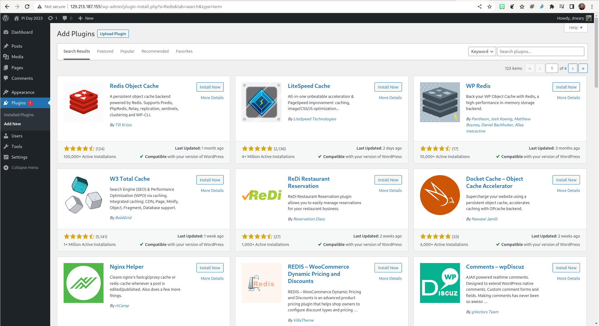
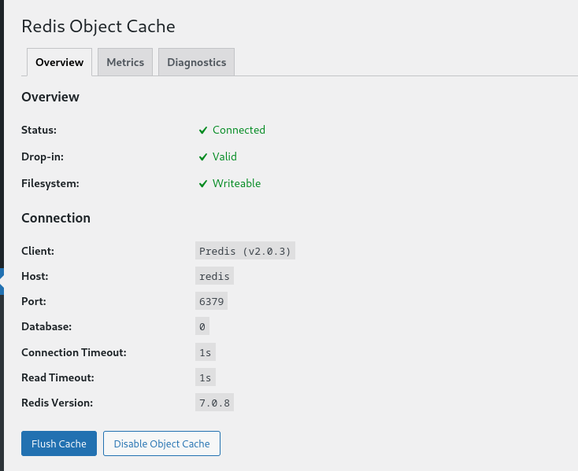
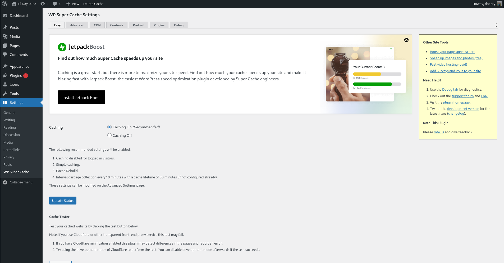

# Part 4: Enabling caching

We can now turn our attention to various methods of caching that we can enable
for our WordPress installation. First, we will add a new Redis service to our
Docker application in `docker-compose.yml`. The default container configuration
will suffice for us, since our Redis instance will not be exposed outside of
our container application. For future deployments, you may want to pass in a
config file and set some security controls around accessing the Redis service.
In our `services` section of `docker-compose.yml` we now add a `redis` service:

```
  redis:
    image: redis:latest
    restart: always
    networks:
      - external_network
```

Now when we next run `docker-compose up -d` we will see the Redis image and
dependency layers being pulled from DockerHub, and the redis container being
started.

Our next stop is to install a WordPress caching plug-in. In the WordPress admin
view, visit the “Plugins” page, and select “Add new”. We are going to install
two plugins – one to cache WordPress content for unauthenticated users, and
another to enable us to connect to a Redis container.



First, we will search for Redis and install and activate the official [Redis
Object Cache plugin](https://wordpress.org/plugins/redis-cache/). To enable our
WordPress instance to connect to our Redis instance, we will also need to add
two options manually to the end of our WordPress configuration file
`wordpress/wp-config.php`, before the line saying “That’s all, stop editing!”
Because the user in the WordPress container does not match the `opc` userid,
you will need to edit the file as root using sudo:

```
...
// Redis configuration
define('WP_REDIS_HOST', 'redis');
define('WP_REDIS_PORT', '6379');

/* That's all, stop editing! Happy publishing. */
...
```

In the Redis plugin options, we can now verify that the object cache is
working by enabling the object cache. Our Redis instance will now be used
automatically as an object cache by WordPress. This means that when PHP objects
are created in memory for things like users, posts, and pages, those objects
will be stored in Redis in addition to being used to generate web pages for the
user. The next time the same query is received, those objects will be loaded
from Redis, rather than being created dynamically from a database query. As a
result, we reduce both the load to the database, and the amount of PHP which
needs to run to construct a page.



Next, we will install and activate
[WP Super Cache](https://wordpress.org/plugins/wp-super-cache/), a page caching
plugin. This plug-in will cache pages after they are created, and serve them to
unauthenticated users. The installation is a two-step process. First we search
for and install the plugin in the plugins page, then we need to activate the
plugin in its settings page. After enabling page caching, we can test the
caching on the settings page to verify that it is working.



The plug-in provides a number of other useful resources for improving the
performance of your page, but those are outside the scope of this tutorial.

We now have a multi-container application load-balancing calls across three
WordPress instances, caching pages that can be served statically to improve
performance, and caching PHP objects to reduce load on both our web servers
and our database, all running behind a proxy nginx service.

As I wrote in the overview at the beginning, there are many more steps
possible to create a scalable production service:

1. Enable secure HTTPS connections by generating and using SSL
   certificates
2. Regularly backing up our database, and verifying emergency restoration
3. Creating a custom container image with our plugins pre-installed to make
   automated deployment and upgrades easier
4. Introducing monitoring to measure performance and receive alerts when the
   performance drops
5. Moving to Kubernetes for a distributed, clustered application that can take
   advantage of cloud resources
6. Using an object store for static resources added to the WordPress instance
   like uploaded images
7. Concealing passwords with Kubernetes secrets
8. Scaling our database, if that becomes necessary, with read-only replicas or
   sharding

But already in a very short time, we can now connect multiple Docker containers
together, scale our application using load balancing, and accelerate the
performance for end-users.


